# 03 — Modelagem Relacional (Schema)

## 1. Visão geral

```
┌─────────────────────────────────────────────────────────────────────┐
│ SCHEMA tenancy                                                       │
│   tenants ◄──────── tenant_id (FK whitelisted) em TODAS as tabelas   │
│   companies ──► tenant_id                                            │
│   tenant_memberships ──► tenant_id, user_id (identity)               │
├─────────────────────────────────────────────────────────────────────┤
│ SCHEMA identity (global)                                             │
│   users, roles, permissions, role_permissions, user_roles (N:N)      │
├─────────────────────────────────────────────────────────────────────┤
│ SCHEMA jobs / recruitment / proposals / financial / notifications    │
│   (sem FK entre módulos de negócio — referências por uuid)           │
├─────────────────────────────────────────────────────────────────────┤
│ SCHEMA audit (audit_logs, particionado por mês)                      │
└─────────────────────────────────────────────────────────────────────┘
```

## 2. Diagrama ER (tabelas críticas)

```mermaid
erDiagram
    TENANTS ||--o{ COMPANIES : "possui (1:N)"
    TENANTS ||--o{ TENANT_MEMBERSHIPS : "membros (1:N)"
    USERS ||--o{ TENANT_MEMBERSHIPS : "participa (1:N)"
    USERS ||--o{ USER_ROLES : "recebe roles (1:N)"
    ROLES ||--o{ USER_ROLES : "concedida (1:N)"
    ROLES ||--o{ ROLE_PERMISSIONS : "agrupa (1:N)"
    PERMISSIONS ||--o{ ROLE_PERMISSIONS : "concedida (1:N)"
    TENANTS ||--o{ USER_ROLES : "escopo (1:N, NULO p/ SUPER_ADMIN)"

    TENANTS ||--o{ JOB_REQUISITIONS : "tenant (1:N)"
    TENANTS ||--o{ CANDIDATES : "tenant (1:N)"
    TENANTS ||--o{ JOB_POSTINGS : "tenant (1:N)"
    TENANTS ||--o{ SERVICE_PROJECTS : "tenant (1:N)"
    TENANTS ||--o{ PROPOSALS : "tenant (1:N)"
    TENANTS ||--o{ OFFERS : "tenant (1:N)"
    TENANTS ||--o{ CONTRACTS : "tenant (1:N)"
    TENANTS ||--o{ INVOICES : "tenant (1:N)"
    TENANTS ||--o{ PAYMENTS : "tenant (1:N)"
    TENANTS ||--o{ PAYOUTS : "tenant (1:N)"
    TENANTS ||--o{ AUDIT_LOGS : "tenant (1:N, NULO p/ global)"

    JOB_REQUISITIONS ||--o{ HIRING_TEAM_MEMBERS : "time (1:N)"
    JOB_REQUISITIONS ||--o{ INTERVIEWS : "agenda (1:N)"
    CANDIDATES ||--o{ INTERVIEWS : "participa (1:N)"
    INTERVIEWS ||--o{ INTERVIEW_FEEDBACKS : "avaliação (1:N)"
    CANDIDATES ||--o{ CANDIDATE_STAGE_HISTORY : "histórico (1:N)"
    JOB_POSTINGS ||--o{ JOB_POSTING_SKILLS : "skills (1:N)"
    SERVICE_PROJECTS ||--o{ PROPOSALS : "recebe propostas (1:N)"
    INVOICES ||--o{ INVOICE_ITEMS : "itens (1:N)"
    CONTRACTS ||--o{ ESCROW_TRANSACTIONS : "retenção (1:N)"
    CONTRACTS ||--o{ PAYMENTS : "pagamento (1:N)"
```



> Todas as entidades do diagrama (exceto `tenants`, `users`, `roles`,
> `permissions`, `role_permissions`) são **tenant-owned** → RLS + `tenant_id`.

## 3. Schema `tenancy`

### `tenants` (global)

| Coluna | Tipo | Observação |
| ------ | ---- | ---------- |
| `id` | `uuid PK` | `gen_random_uuid()` |
| `name` | `varchar(150) NOT NULL` | |
| `slug` | `varchar(80) NOT NULL UNIQUE` | identifica o tenant em URLs |
| `tier` | `smallint NOT NULL DEFAULT 1` | 1=Standard, 2=Pro, 3=Enterprise |
| `status` | `smallint NOT NULL DEFAULT 1` | 1=Active, 2=Suspended, 3=Cancelled |
| `timezone` | `varchar(50)` | ex.: `America/Sao_Paulo` |
| `locale` | `varchar(10) DEFAULT 'pt-BR'` | |
| `created_at` / `updated_at` | `timestamptz NOT NULL DEFAULT now()` | |

### `companies` (tenant-owned)

| Coluna | Tipo | Observação |
| ------ | ---- | ---------- |
| `id` | `uuid PK` | |
| `tenant_id` | `uuid NOT NULL FK → tenancy.tenants` | |
| `legal_name` | `varchar(200) NOT NULL` | |
| `trade_name` | `varchar(200)` | |
| `document` | `varchar(20) NOT NULL` | CNPJ/CPF normalizado |
| `email` / `phone` | `varchar` | contato da PJ |
| `status` | `smallint NOT NULL DEFAULT 1` | 1=Active, 2=Inactive |
| `created_at` / `updated_at` | `timestamptz` | |

**Índices:** `UNIQUE (tenant_id, document)` · `ix_companies_tenant_id (tenant_id)`

### `tenant_memberships` (tenant-owned)

| Coluna | Tipo | Observação |
| ------ | ---- | ---------- |
| `tenant_id` | `uuid NOT NULL FK → tenancy.tenants` | |
| `user_id` | `uuid NOT NULL FK → identity.users` | FK whitelisted (núcleo) |
| `status` | `smallint NOT NULL DEFAULT 1` | 1=Active, 2=Invited, 3=Disabled |
| `joined_at` | `timestamptz NOT NULL DEFAULT now()` | |

**PK `(tenant_id, user_id)`** · índice `ix_tenant_memberships_user (user_id)`
· **RLS** por `tenant_id`.

> A membership é a base: `user_roles` só existe com membership ativa (FK
> composta, R-05). Roles concedidas = dados em `identity.user_roles`.

### `tenant_settings` (tenant-owned)

`tenant_id uuid PK` + `hiring_workflow jsonb` + `branding jsonb` + `feature_flags jsonb`.

## 4. Schema `identity` (núcleo global + escopo por tenant)

### `users` (global — sem RLS)

| Coluna | Tipo | Observação |
| ------ | ---- | ---------- |
| `id` | `uuid PK` | |
| `email` | `varchar(320) NOT NULL` | único via índice funcional `lower(email)` |
| `password_hash` | `text NOT NULL` | argon2id/bcrypt |
| `full_name` | `varchar(200) NOT NULL` | |
| `status` | `smallint NOT NULL DEFAULT 1` | 1=Active, 2=Locked, 3=Disabled |
| `email_verified_at` | `timestamptz` | |
| `last_login_at` | `timestamptz` | |
| `created_at` / `updated_at` | `timestamptz` | |

**Índices:** `UNIQUE (lower(email))` · `ix_users_status (status)`

### `roles` (global)

| Coluna | Tipo | Observação |
| ------ | ---- | ---------- |
| `id` | `uuid PK` | |
| `code` | `varchar(50) NOT NULL UNIQUE` | ver catálogo abaixo |
| `name` | `varchar(120) NOT NULL` | ex.: "Recruiter" |
| `is_global` | `boolean NOT NULL DEFAULT false` | `true` apenas p/ SUPER_ADMIN |
| `description` | `text` | |

**Índice auxiliar (alvo de FK composta):** `UNIQUE (id, is_global)`

### `permissions` (global)

`id uuid PK` · `code varchar(100) NOT NULL UNIQUE` (ex.: `recruitment.requisition.publish`).

### `role_permissions` (global)

`role_id uuid FK → roles` · `permission_id uuid FK → permissions` · **PK `(role_id, permission_id)`**

### `user_roles` (escopo misto — RLS especial)

| Coluna | Tipo | Observação |
| ------ | ---- | ---------- |
| `user_id` | `uuid NOT NULL FK → identity.users` | |
| `tenant_id` | `uuid NULL FK → tenancy.tenants` | **NULL = role global (SUPER_ADMIN)** |
| `role_id` | `uuid NOT NULL` | |
| `is_global` | `boolean NOT NULL` | espelho da role (para a FK composta) |
| `granted_by` | `uuid NULL` | quem concedeu (usuário) |
| `granted_at` | `timestamptz NOT NULL DEFAULT now()` | |

**PK `(user_id, tenant_id, role_id)`** — permite múltiplas roles por usuário no
mesmo tenant (R-05).

**Integridade do escopo (R-04):**
```sql
-- FK composta: a role referenciada deve existir com o mesmo is_global
FOREIGN KEY (role_id, is_global) REFERENCES identity.roles (id, is_global)
-- CHECK: role global ⇒ tenant NULL; role de tenant ⇒ tenant presente
CHECK ((tenant_id IS NULL) = is_global)
-- FK condicional (MATCH SIMPLE): linhas com tenant exigem membership ativa
FOREIGN KEY (user_id, tenant_id) REFERENCES tenancy.tenant_memberships (user_id, tenant_id)
```

**Índices:** `ix_user_roles_tenant_role (tenant_id, role_id)` ·
`ix_user_roles_user (user_id)`

**RLS especial (tabela com escopo misto):**
```sql
CREATE POLICY tenant_scope ON identity.user_roles
    FOR ALL
    USING ((tenant_id::text = current_setting('app.tenant_id', true))
        OR (tenant_id IS NULL AND current_setting('app.tenant_id', true) IS NULL))
    WITH CHECK ((tenant_id::text = current_setting('app.tenant_id', true))
        OR (tenant_id IS NULL AND current_setting('app.tenant_id', true) IS NULL));
```
Contexto de tenant enxerga apenas roles do próprio tenant; contexto global
(SUPER_ADMIN) enxerga apenas roles globais — nunca os dois misturados.

### Resolução de permissões efetivas (multi-role, R-05)

```sql
SELECT DISTINCT p.code
FROM identity.user_roles ur
JOIN identity.role_permissions rp ON rp.role_id = ur.role_id
JOIN identity.permissions p ON p.id = rp.permission_id
WHERE ur.user_id = :userId
  AND ur.tenant_id = :tenantId          -- ou: AND ur.tenant_id IS NULL (contexto global)
```

### `refresh_tokens` (tenant-owned)

`id uuid PK` · `tenant_id uuid NOT NULL` · `user_id uuid` · `token_hash text UNIQUE`
· `expires_at timestamptz` · `revoked_at timestamptz` · `index (tenant_id, user_id)`.

## 5. Schema `recruitment`

### `job_requisitions`

| Coluna | Tipo | Observação |
| ------ | ---- | ---------- |
| `id` | `uuid PK` | |
| `tenant_id` | `uuid NOT NULL` | |
| `company_id` | `uuid NULL` | ref. `tenancy.companies` (uuid, sem FK) |
| `title` | `varchar(120) NOT NULL` | VO `JobTitle` |
| `description` | `text NOT NULL` | |
| `salary_min` / `salary_max` | `numeric(12,2)` | `salary_max` nullable (VO `SalaryRange`) |
| `salary_currency` | `char(3) NOT NULL` | |
| `status` | `smallint NOT NULL DEFAULT 1` | 1=Draft…5=Cancelled (CHECK) |
| `published_at` / `closed_at` | `timestamptz` | |
| `close_reason` | `text` | |
| `created_by` | `uuid` | ref. `identity.users` (uuid, sem FK) |
| `created_at` / `updated_at` | `timestamptz` | |

**Índices:** `UNIQUE (tenant_id, id)` · `ix_job_requisitions_tenant_status (tenant_id, status)`
· `ix_job_requisitions_tenant_company (tenant_id, company_id)`
· **CHECK** `chk_salary_range (salary_min <= salary_max)` e `chk_status (status IN (1..5))`.

### `hiring_team_members`

`job_requisition_id uuid FK → job_requisitions (ON DELETE CASCADE)` ·
`recruiter_user_id uuid` (ref. users) · `role smallint CHECK` (1=Recruiter, 2=Sourcer,
3=Interviewer, 4=HiringManager) · `added_at timestamptz` ·
**PK `(job_requisition_id, recruiter_user_id)`** · `tenant_id` herdado via FK? →
**não**: por convenção, tabelas tenant-owned carregam `tenant_id` explícito
(necessário para RLS). Adicionar `tenant_id uuid NOT NULL`.

### `candidates`

`id` · `tenant_id` · `user_id uuid NULL` (conta na plataforma, sem FK) ·
`full_name varchar(200)` · `email varchar(320)` · `phone varchar(30)` ·
`source smallint` (1=Sourced, 2=Applied) · `status smallint` (1=Sourced…7=Hired/Rejected) ·
`resume_url text` · `created_at/updated_at`.

**Índices:** `UNIQUE (tenant_id, lower(email))` · `ix_candidates_tenant_status (tenant_id, status)`
· `ix_candidates_tenant_user (tenant_id, user_id)`.

### `candidate_stage_history`

`id` · `tenant_id` · `candidate_id uuid FK → candidates (CASCADE)` · `from_status smallint`
· `to_status smallint` · `changed_by uuid` · `changed_at timestamptz`.
**Índice:** `ix_candidate_stage_history_candidate (candidate_id)`.

### `interviews` e `interview_feedbacks`

- `interviews`: `id` · `tenant_id` · `job_requisition_id uuid FK` · `candidate_id uuid FK`
  · `scheduled_at timestamptz` · `duration_minutes smallint` · `type smallint`
  (1=Phone, 2=Technical, 3=Cultural, 4=Final) · `status smallint` (1=Scheduled, 2=Completed,
  3=Cancelled) · `ix_interviews_tenant_date (tenant_id, scheduled_at)`.
- `interview_feedbacks`: `id` · `tenant_id` · `interview_id uuid FK → interviews (CASCADE)`
  · `interviewer_user_id uuid` · `rating smallint` · `notes text` · `submitted_at timestamptz`
  · **UNIQUE `(interview_id, interviewer_user_id)`**.

## 6. Schema `jobs`

### `job_postings` (vitrine)

`id` · `tenant_id` · `company_id uuid NULL` · `job_requisition_id uuid NULL`
(ref. recruitment, sem FK) · `title varchar(200)` · `description text` · `location varchar(150)`
· `remote smallint` (0=Presencial, 1=Híbrido, 2=Remoto) · `status smallint`
(1=Draft, 2=Published, 3=Closed, 4=Archived) · `published_at` · `created_by`.
**Índices:** `ix_job_postings_tenant_status (tenant_id, status)` ·
`ix_job_postings_tenant_published (tenant_id, published_at DESC)`.

### `service_projects` (projetos de serviço)

`id` · `tenant_id` · `company_id uuid NULL` · `title varchar(200)` · `description text`
· `budget_min/budget_max numeric(12,2)` · `currency char(3)` · `status smallint`
(1=Draft, 2=Open, 3=InProgress, 4=Completed, 5=Cancelled) · `deadline date` ·
`created_at/updated_at`.
**Índices:** `ix_service_projects_tenant_status (tenant_id, status)`.

### `skills` / `categories` (catálogo tenant-owned)

- `skills`: `tenant_id` · `name varchar(100)` · **UNIQUE `(tenant_id, lower(name))`**.
- `categories`: `tenant_id` · `name varchar(100)` · `type smallint` (1=Job, 2=Project) ·
  **UNIQUE `(tenant_id, name, type)`**.
- `job_posting_skills`: `job_posting_id uuid FK → job_postings (CASCADE)` ·
  `skill_id uuid FK → skills (CASCADE)` · PK `(job_posting_id, skill_id)` + `tenant_id`.

## 7. Schema `proposals`

### `proposals`

`id` · `tenant_id` · `service_project_id uuid NULL` (ref. jobs) · `job_posting_id uuid NULL`
(ref. jobs) · `provider_user_id uuid NOT NULL` (ref. users) · `message text` ·
`amount numeric(12,2)` · `currency char(3)` · `status smallint`
(1=Draft, 2=Submitted, 3=Negotiating, 4=Accepted, 5=Rejected, 6=Withdrawn) ·
`submitted_at` · `responded_at` · `created_at/updated_at`.
**Índices:** `ix_proposals_tenant_status (tenant_id, status)` ·
`ix_proposals_tenant_project (tenant_id, service_project_id)`.

### `offers` (oferta formal pós-recruitment)

`id` · `tenant_id` · `job_requisition_id uuid NULL` · `candidate_user_id uuid NOT NULL` ·
`salary_amount numeric(12,2)` · `currency char(3)` · `status smallint`
(1=Created, 2=Sent, 3=Accepted, 4=Declined, 5=Expired) · `valid_until date` ·
`decided_at` · `created_at/updated_at`. **Índice:** `ix_offers_tenant_status (tenant_id, status)`.

### `contracts`

`id` · `tenant_id` · `offer_id uuid NULL FK → proposals.offers` (mesmo schema, permitido)
· `proposal_id uuid NULL FK → proposals.proposals` · `contract_type smallint`
(1=Employment, 2=Service) · `company_id uuid NULL` · `provider_user_id uuid` ·
`status smallint` (1=Draft, 2=Signed, 3=Active, 4=Completed, 5=Terminated) ·
`signed_at` · `start_date` · `end_date` · `terms jsonb`.
**Índices:** `ix_contracts_tenant_status (tenant_id, status)` · `ix_contracts_tenant_provider (tenant_id, provider_user_id)`.

## 8. Schema `financial`

### `invoices`

`id` · `tenant_id` · `contract_id uuid NULL` (ref. proposals) · `billing_cycle_id uuid NULL`
· `number varchar(40)` · `status smallint` (1=Draft, 2=Issued, 3=Paid, 4=Overdue, 5=Cancelled)
· `total_amount numeric(12,2)` · `currency char(3)` · `due_date date` · `issued_at` · `paid_at`.
**Índices:** `UNIQUE (tenant_id, number)` · `ix_invoices_tenant_status_due (tenant_id, status, due_date)`.

### `invoice_items`

`id` · `tenant_id` · `invoice_id uuid FK → invoices (CASCADE)` · `description varchar(255)`
· `quantity numeric(10,2)` · `unit_amount numeric(12,2)` · `total numeric(12,2)`.
**Índice:** `ix_invoice_items_invoice (invoice_id)`.

### `payments`

`id` · `tenant_id` · `invoice_id uuid NULL FK → financial.invoices` · `contract_id uuid NULL`
· `payer_user_id uuid` · `receiver_user_id uuid NULL` · `amount numeric(12,2)` ·
`currency char(3)` · `method smallint` (1=Card, 2=Pix, 3=BankTransfer, 4=Wallet) ·
`status smallint` (1=Pending, 2=Authorized, 3=Captured, 4=Failed, 5=Refunded) ·
`gateway_ref varchar(100)` · `paid_at`.
**Índices:** `ix_payments_tenant_status (tenant_id, status)` · `ix_payments_tenant_invoice (tenant_id, invoice_id)`.

### `escrow_transactions` (retenção até entrega)

`id` · `tenant_id` · `contract_id uuid NULL` · `payment_id uuid NULL FK → financial.payments`
· `amount numeric(12,2)` · `currency char(3)` · `status smallint` (1=Held, 2=Released, 3=Refunded)
· `held_at` · `released_at` · `released_to_user_id uuid`.
**Índice:** `ix_escrow_transactions_tenant_status (tenant_id, status)`.

### `payouts`

`id` · `tenant_id` · `user_id uuid` (prestador) · `amount numeric(12,2)` · `currency char(3)`
· `status smallint` (1=Pending, 2=Processing, 3=Completed, 4=Failed) · `bank_data jsonb`
(dados bancários sensíveis — cifrados na app) · `requested_at` · `completed_at`.
**Índice:** `ix_payouts_tenant_status (tenant_id, status)`.

### 8.1 Novas tabelas do ciclo Asaas + Split (DB-09, ver docs/financial)

| Tabela | Papel | Imutabilidade |
| ------ | ----- | ------------- |
| `transactions` | `FinancialTransaction` (máquina de estados FIN-02): `tenant_id`, `amount numeric(12,2)`, `currency char(3)`, `status smallint` (1=Pending…9=ReleaseFailed), `asaas_payment_id varchar(40)`, `asaas_transfer_id varchar(40)`, `provider_event_id uuid NULL`, `received_at/released_at timestamptz` | app: **SELECT/INSERT** + `EXECUTE transition_transaction` (sem UPDATE direto) |
| `transaction_events` | cada transição: `tenant_id`, `transaction_id uuid FK → transactions (RESTRICT)`, `from_status/to_status smallint`, `trigger_code smallint`, `provider_event_id uuid NULL`, `occurred_at`; **UNIQUE `(transaction_id, provider_event_id)`** | append-only |
| `transition_rules` | matriz de transições espelhada (alvo da função `transition_transaction`); mantida em sincronia com o domínio via teste de contrato | somente migrator |
| `asaas_webhook_inbox` | payload íntegro de webhook: `event_id uuid` + `event_type varchar(60)` **UNIQUE**, `tenant_id uuid NULL`, `payment_id/transfer_id varchar(40)`, `payload jsonb`, `received_at`, `processed_at`, `status smallint`, `error text` | app: SELECT/INSERT + funções de claim/processado |
| `transfers` | Transfer Asaas (liberação): `tenant_id`, `transaction_id uuid FK`, `asaas_transfer_id varchar(40)`, `wallet_id varchar(40)`, `amount`, `currency`, `status smallint` (1=Created, 2=Done, 3=Failed), `created_at`, `confirmed_at` | app: SELECT/INSERT |

**Índices:** `ix_transactions_tenant_status (tenant_id, status)` ·
`ix_transactions_tenant_asaas (tenant_id, asaas_payment_id)` ·
`ix_asaas_webhook_pending (status, received_at) WHERE status = 1` ·
`ix_transaction_events_tenant (tenant_id, occurred_at DESC)`.

## 9. Schema `audit` (global p/ escrita, tenant-owned)

### `audit_logs` (tenant_id nullable)

| Coluna | Tipo | Observação |
| ------ | ---- | ---------- |
| `id` | `uuid PK` (ou `bigint` para particionamento) | |
| `tenant_id` | `uuid NULL` | NULL = ação global (SUPER_ADMIN/plataforma) |
| `user_id` | `uuid NULL` | autor da ação |
| `action` | `varchar(100) NOT NULL` | ex.: `job_requisition.published` |
| `entity_type` | `varchar(100)` | ex.: `JobRequisition` |
| `entity_id` | `uuid` | |
| `before` / `after` | `jsonb` | diff de estado |
| `ip` | `inet` | |
| `user_agent` | `text` | |
| `occurred_at` | `timestamptz NOT NULL DEFAULT now()` | |

**Particionamento:** `PARTITION BY RANGE (occurred_at)` — partição mensal via
`pg_partman` (R-09/arquitetura). **Índices:** `ix_audit_logs_tenant_time (tenant_id, occurred_at DESC)`
· `ix_audit_logs_entity (entity_type, entity_id)`.
**RLS** igual ao padrão nullable (como `user_roles`): contexto de tenant só vê seus
registros; contexto global vê `tenant_id IS NULL`.

## 10. Outbox (por módulo)

Cada módulo possui `outbox_messages` (já previsto na arquitetura):
`id uuid PK` · `tenant_id uuid` · `type varchar(200)` · `payload jsonb` ·
`occurred_on timestamptz` · `processed_on timestamptz NULL` ·
**Índice:** `ix_outbox_pending (processed_on, occurred_on) WHERE processed_on IS NULL`.

## 11. Testes obrigatórios (R-10)

Sempre que criar tabela tenant-owned: (1) leitura cruzada vazia, (2) UPDATE/DELETE
cruzado bloqueado, (3) INSERT sem tenant recusado, (4) linha global não vaza para
tenant. Testes em `tests/Integration/Tenancy/` (ver arquitetura, seção Testes).