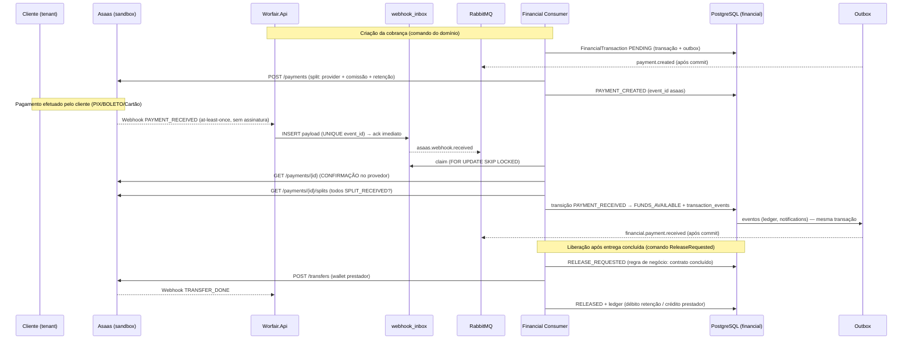

# 01 — Fluxo de Pagamento com Asaas Payment Split

## 1. Capacidades reais da API Asaas (sandbox)

O desenho respeita **o que a API Asaas realmente oferece**:

| Capacidade | Asaas | Uso no Worfair |
| ---------- | ----- | -------------- |
| Criar cobrança (`POST /payments`) | BOLETO, CREDIT_CARD, PIX, UNDEFINED | Cobrança do cliente (tenant) |
| **Payment Split** (`split[]` na cobrança) | Divide o valor **automaticamente quando o pagamento é confirmado** entre a conta dona e **wallets de outras contas Asaas** (`walletId`) | Comissão da plataforma + parcela do prestador |
| Split por percentual ou valor fixo | `percentualValue` (máx. 2 casas, soma ≤ 100%) ou `fixedValue` (soma ≤ valor) | Prestador (percentual), comissão (fixo) |
| Status dos splits (`GET /payments/{id}/splits`) | `SPLIT_PENDING` / `SPLIT_RECEIVED` / `SPLIT_CANCELLED` | Confirmação de `FUNDS_AVAILABLE` |
| Transfer entre contas (`POST /transfers`) | `walletId` (conta Asaas) ou `pixAddress` (externo) | Liberação da retenção |
| Webhooks | `PAYMENT_CONFIRMED`, `PAYMENT_RECEIVED`, `PAYMENT_REFUNDED`, `TRANSFER_DONE`, `TRANSFER_FAILED`, … | Orquestração assíncrona |
| **Escrow jurídico** | **NÃO existe no Asaas** | Não modelado como tal (ver §3) |

> **Premissas a validar no sandbox (fase de spike):** (1) evento por split não é
> emitido em todos os casos — a liquidação dos splits é **confirmada por
> polling** em `GET /payments/{id}/splits`; (2) custo de split/taxa — quem paga a
> taxa do split é configurável na conta; (3) `walletId` exige conta digital ativa
> do destinatário (prestador precisa de conta Asaas).

## 2. Papéis das contas e wallets

| Ator | Conta Asaas | Função |
| ---- | ----------- | ------ |
| Plataforma Worfair | Conta principal (por ambiente) | Dona da cobrança; recebe comissão (fica na conta) |
| Prestador (PROVIDER) | Conta própria + `walletId` registrado no tenant | Recebe `percentualValue` do split automaticamente |
| Cliente (tenant) | Registrado como **customer** Asaas | Paga a cobrança (BOLETO/PIX/Cartão) |

Configuração por tenant (`tenancy.tenant_settings` → `asaas`):

```json
{
  "asaas": {
    "customerId": "cus_0000...",
    "providerWalletId": "wal_0000...",
    "providerSplitPercent": 85.00,
    "platformFeePercent": 5.00,
    "retentionPercent": 10.00,
    "releaseRule": "delivery_confirmed"
  }
}
```

> **PCI-DSS:** cartão de crédito é processado 100% pelo checkout/hospedagem do
> Asaas — a plataforma **nunca** vê/toca dados de cartão.

## 3. Retenção operacional × escrow jurídico

O Asaas **não fornece escrow** (serviço jurídico de retenção de terceiros).
O Worfair implementa **retenção operacional**:

- No recebimento, o split envia a parte do prestador à wallet dele; a **retenção
  permanece na conta Asaas da plataforma** (parte não dividida da cobrança).
- A liberação ocorre **somente** após a entrega/contrato concluído
  (`FUNDS_AVAILABLE → RELEASE_REQUESTED → RELEASED`) e é executada como
  **Transfer Asaas** para a wallet do prestador.
- Riscos assumidos (documentados): estorno/chargeback da cobrança (a retenção
  cobre o risco da plataforma), insolvência operacional. Mitigações: liberação
  mínima por regra de negócio, `PAYMENT_REFUNDED` estorna antes da liberação,
  auditoria imutável de cada centavo (ledger).

## 4. Fluxo arquitetural completo



## 5. Estrutura do módulo (clean architecture)

```
src/Modules/Financial/
├── Worfair.Modules.Financial.Domain/
│   ├── Aggregates/
│   │   ├── FinancialTransaction/
│   │   │   ├── FinancialTransaction.cs        # máquina de estados (doc 02)
│   │   │   ├── FinancialTransactionId.cs
│   │   │   ├── FinancialTransactionStatus.cs
│   │   │   ├── FinancialTransactionTrigger.cs
│   │   │   └── Events/ (PaymentReceivedDomainEvent, FundsReleasedDomainEvent…)
│   │   ├── LedgerEntry/
│   │   └── WebhookInboxItem/                   # claim + processamento
│   ├── Gateways/
│   │   ├── IAsaasGateway.cs                    # port → Asaas (sandbox)
│   │   └── IAsaasWebhookAuthenticator.cs       # confirmação no provedor
│   ├── ValueObjects/ (Money, SplitConfig, WalletId…)
│   ├── Errors/FinancialTransactionErrors.cs
│   └── Repositories/
│       ├── IFinancialTransactionRepository.cs
│       ├── IWebhookInboxRepository.cs
│       └── ILedgerRepository.cs
├── Worfair.Modules.Financial.Application/
│   ├── Commands/ (CreatePayment, RequestRelease…)
│   ├── Consumers/ (AsaasWebhookConsumer, TransferDoneConsumer…)
│   ├── Integration/ (eventos de entrada de outros módulos: ContractCompleted)
│   └── Dtos/
├── Worfair.Modules.Financial.Infrastructure/
│   ├── Asaas/ (AsaasGateway.cs, DTOs, rate limit/retry)
│   ├── Persistence/ (FinancialDbContext, Configurations, Migrations, Repositories)
│   ├── Messaging/ (MassTransit: consumers, contracts)
│   └── Outbox/ (configuração AddEntityFrameworkOutbox)
├── Worfair.Modules.Financial.Contracts/
│   └── Events/ (PaymentReceivedIntegrationEvent, FundsReleasedIntegrationEvent…)
└── Worfair.Modules.Financial/ (composition root: AddFinancialModule)
```

## 6. Contrato da porta do provedor

```csharp
// Financial.Domain/Gateways/IAsaasGateway.cs (porta — implementada em Infrastructure/Asaas)
public interface IAsaasGateway
{
    Task<AsaasPayment> CreatePaymentAsync(CreateAsaasPaymentRequest request, CancellationToken ct);
    Task<AsaasPayment?> GetPaymentAsync(string asaasPaymentId, CancellationToken ct);
    Task<IReadOnlyList<AsaasSplit>> GetSplitsAsync(string asaasPaymentId, CancellationToken ct);
    Task<AsaasTransfer> CreateTransferAsync(CreateAsaasTransferRequest request, CancellationToken ct);
    Task<AsaasTransfer?> GetTransferAsync(string asaasTransferId, CancellationToken ct);
}
```

```csharp
public sealed record CreateAsaasPaymentRequest(
    string CustomerId, decimal Value, string BillingType, DateOnly DueDate,
    IReadOnlyList<AsaasSplitItem> Split);

public sealed record AsaasSplitItem(string WalletId, decimal? PercentualValue, decimal? FixedValue);

public sealed record AsaasPayment(string Id, string Status, decimal Value, DateTime? ConfirmedDate);
public sealed record AsaasSplit(string SplitId, string Status);   // SPLIT_PENDING | SPLIT_RECEIVED | SPLIT_CANCELLED
```

**Regras do split (aplicadas no domínio antes de chamar o Asaas):**
- Soma dos `percentualValue` ≤ 100,00; soma dos `fixedValue` ≤ valor da cobrança.
- No mínimo um split por cobrança (prestador); comissão/retenção ficam na conta
  dona (não há split para a própria conta).
- `walletId` deve pertencer a conta Asaas ativa do prestador (validado no
  onboarding do PROVIDER).