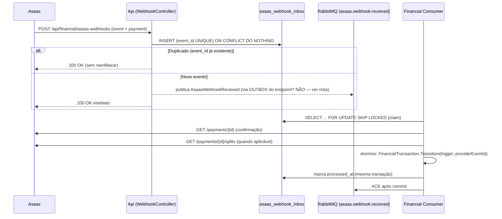

# 03 — Webhooks Asaas × RabbitMQ

## 1. Princípios

1. **Webhook = aviso, não verdade.** O payload é armazenado, mas **toda
   transição é confirmada no Asaas** (`GET /payments/{id}`, `GET /transfers/{id}`)
   antes de ser aplicada (FIN-04).
2. **At-least-once:** o Asaas pode entregar o mesmo evento várias vezes (e em
   ordem arbitrária). Todo consumo é idempotente (doc 04).
3. **Ack pós-commit:** o RabbitMQ só recebe ACK depois que a transação
   (estado + eventos + outbox) foi persistida. Falha ⇒ NACK/retry — nunca
   perde evento.
4. **Resposta HTTP rápida:** o endpoint de webhook do Asaas responde **200
   imediatamente** após persistir o payload no inbox; o processamento é
   assíncrono.

## 2. Topologia RabbitMQ

```
Exchange: worfair.events (topic)          DLX: worfair.dlx
Routing keys: financial.payment.received · financial.payment.refunded
              financial.transfer.done · financial.transfer.failed
              financial.release.requested · asaas.webhook.received
```

| Fila | Consumidor | Routing key de entrada | Ação |
| ---- | ---------- | ---------------------- | ---- |
| `worfair.financial.asaas-webhooks` | `AsaasWebhookProcessorConsumer` | `asaas.webhook.received` | claim do inbox → confirma no Asaas → transição → commit |
| `worfair.financial.events` | consumidores por módulo (Notifications, Proposals, Jobs) | `financial.*` | efeitos colaterais pós-commit |
| `worfair.financial.dlx` | retry/error manual | — | mensagens mortas após retries (DLQ + TTL) |

**Retry:** `UseMessageRetry` (5× exponencial 1s→30s) no consumidor + fila de
retry com TTL no RabbitMQ (`x-dead-letter-exchange`); após o limite, mensagem
vai para a fila de erro (`worfair.financial.error`) para análise manual —
**nunca** descartada silenciosamente.

**Ordem:** processamento de eventos do mesmo pagamento é serializado por chave
(`payment_{id}`) via **partições de routing key** ou lock otimista no agregado
(versão `xmin`/`rowversion`) — suficiente para o volume esperado; `SKIP LOCKED`
evita processamento concorrente do mesmo inbox item.

## 3. Fluxo de ingestão (endpoint de webhook)



> **Nota de implementação:** o publish do evento de processamento não usa o
> outbox do endpoint (o inbox já é a garantia de persistência); o consumidor
> (que lê o banco) é quem aplica as transições **usando o outbox** para os
> eventos de saída (doc 04/05). O endpoint publica `AsaasWebhookReceived` para a
> fila de processamento após o INSERT no inbox (publicação imediata aceitável —
> a entrega é reexecutável e idempotente). Em cenário com estrita garantia,
> alternar para outbox no endpoint também é suportado.

## 4. Contrato do evento de ingestão

```csharp
// Financial.Contracts/Events/AsaasWebhookReceivedIntegrationEvent.cs
public sealed record AsaasWebhookReceivedIntegrationEvent(
    Guid EventId,            // id do payload do Asaas (chave de idempotência)
    string EventType,        // "PAYMENT_RECEIVED" | "TRANSFER_DONE" | ...
    string? PaymentId,       // pay_...
    string? TransferId,      // tra_...
    TenantId? TenantId,      // resolvido do payload/pagamento (nunca do header)
    DateTime OccurredOn);
```

## 5. Requisitos do endpoint de webhook

- **Sem autenticação** (URL pública do Asaas) — por isso a confirmação no
  provedor é obrigatória (FIN-04); nunca confiar no `event`/`payment` do payload.
- `Content-Type: application/json`; payload limitado (ex.: 256 KB).
- **Não** aceitar `X-Tenant-Id` (SEC-02): o tenant é resolvido do **conteúdo**
  validado (customer/payment → tenant) — ou via busca no Asaas.
- Resposta sempre `200` após persistir no inbox (mesmo duplicado); `500` só em
  falha de banco (Asaas reenviará).
- Registro em `audit.audit_logs` (action `financial.asaas.webhook.received`,
  tenant resolvido, payload redigido em `after` quando contiver PII).

## 6. Consumidores dos eventos de saída (pós-commit)

| Evento (outbox → MQ) | Consumidor | Efeito |
| -------------------- | ---------- | ------ |
| `financial.payment.received` | Notifications | notifica cliente + prestador |
| `financial.payment.refunded` | Notifications, Proposals | atualiza contrato |
| `financial.release.requested` | Proposals | registra liberação pendente |
| `financial.funds.released` | Notifications, Jobs | conclui projeto/contrato |

Consumidores de outros módulos são **sempre idempotentes** (dedup por
`IntegrationEvent.Id` — D-07) e nunca alteram tabelas do módulo Financial.